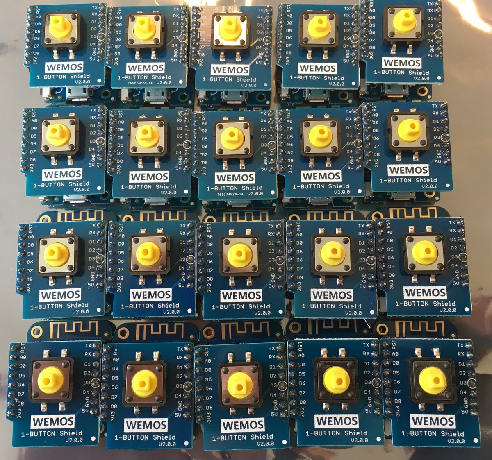

Wemos D1 mini instructions
==========================

We are providing (at least on loan for the duration of the workshop) a
Wemos D1 mini preloaded with a sketch which has the following
capabilities:

-   connects to a WiFi SSID called "XXX" with password "YYYY"
-   connects to an MQTT broker on 192.168.8.1
-   toggles a pushbutton soldered between GND and D3 and publishes a
    status ON/OFF to openhab/switch/xxxxxx where xxxxx is the chip ID of
    the microcontroller
-   enables users to toggle the blue on-board LED by publishing "1" or
    "0" to the topic "openhab/xxxxxx/led" whereupon the microcontroller
    publishes the current state back on

```
openhab/xxxxxx/led/state on|off
```



Soldering instructions
----------------------

The pushbutton must be soldered between Ground (GND) and D3, i.e. when
the button is pressed, the two pins are closed, when the button is
released, they are open.

Uploading the sketch
--------------------

The sketch (wemos-ohab.ino) is uploaded to the Wemos D1 mini via the
Arduino IDE. We've used the 1.8.5 version of the IDE
(<https://www.arduino.cc/en/Main/Software>). After installing that (on
Linux is fine), some extra steps need to be taken:

-   Start Arduino and open Preferences window.
-   Enter
    \`http://arduino.esp8266.com/stable/package~esp8266comindex~.json\`
    into **Additional Board Manager** URLs field. You can add multiple
    URLs, separating them with commas.
-   Select **Tools** -&gt; **Boards Manager** menu and install
    **ESP8266** platform
-   Select **Tools** -&gt; **Board** and choose **WeMos D1 R2 and mini**

Two extra libraries are needed:

1.  AsyncMqttClient
2.  And the dependency ESPAsyncTCP

### AsyncMqttClient

-   Download the \`AsyncMqttClient\` file from
    \`https://platformio.org/lib/show/346/AsyncMqttClient/installation\`
-   Extract the file into a temporary directory \`mkdir tt; cd tt; tar
    -xvf ../AsyncMqttClient~0~.8.2~346~.tar.gz; zip -r
    ../AsyncMqttClient~0~.8.2~346~.zip; cd ..; rm -rf tt'
-   Select **Sketch** -&gt; **Include Library** -&gt; **Add .ZIP
    Library** and select the \`AsyncMqttClient~0~.8.2~346~.zip\` file
-   Select **Sketch** -&gt; **Include Library** -&gt; select
    **AsyncMqttClient**

### ESPAsyncTCP

-   Download the \`ESPAsyncTCP\` file from
    \`https://platformio.org/lib/show/305/ESPAsyncTCP/installation\`
-   Extract the file into a temporary directory \`mkdir tt; cd tt; tar
    -xvf ../ESPAsyncTCP~1~.1.3~305~.tar.gz; zip -r
    ../ESPAsyncTCP~1~.1.3~305~.zip; cd ..; rm -rf tt'
-   Select **Sketch** -&gt; **Include Library** -&gt; **Add .ZIP
    Library** and select the \`ESPAsyncTCP~1~.1.3~305~.zip\` file
-   Select **Sketch** -&gt; **Include Library** -&gt; select **ESP
    AsyncTCP**

Attach the Wemos D1 mini via USB.

Open the `wemos-ohab.ino` sketch in the IDE, then:

-   select board: `Wemos D1 R2 & mini`
-   select Flash size: `4M (1M SPIFFS)`
-   select `115200` baud
-   select the correct port (e.g. `ttyUSB0`)

From the menu, chose Sketch-&gt;Upload to compile the sketch and upload
to the Wemos D1 mini
